# C# COMPLETO 2020 Programação Orientada a Objetos + Projetos

https://www.udemy.com/course/programacao-orientada-a-objetos-csharp/

Curso mais didático e completo de C# e OO Projetos com UML, ASP.NET, Entity Framework, LINQ, Lambda e muito mais

## <a name="indice">Índice</a>

1. [Apresentação do curso e orientações](#parte1)     
2. [Introdução a C# e .NET](#parte2)     
3. [Recapitulação de Lógica de Programação usando C#](#parte3)     
4. [Classes, atributos, métodos, membros estáticos](#parte4)     
5. [Construtores, palavra this, sobrecarga, encapsulamento](#parte5)     
6. [Comportamento de memória, arrays, listas](#parte6)     
7. [Tópicos especiais em C# - PARTE 1](#parte7)     
8. [Introdução ao Git e Github](#parte8)     
9. [Enumerações e composição](#parte9)     
10. [Herança e polimorfismo](#parte10)     
11. [Tratamento de exceções](#parte11)     
12. [Projeto: Sistema de jogo de xadrez](#parte12)     
13. [Trabalhando com arquivos](#parte13)     
14. [Interfaces](#parte14)     
15. [Tópicos especiais em C# - PARTE 2](#parte15)     
16. [Expressões lambda, delegates, LINQ](#parte16)     
17. [Projeto: Sistema Web com ASP .NET Core MVC e Entity Framework](#parte17)     
18. [Seção bônus](#parte18)     
---


## <a name="parte1">1 - Apresentação do curso e orientações</a>


[Voltar ao Índice](#indice)

---


## <a name="parte2">2 - Introdução a C# e .NET</a>


[Voltar ao Índice](#indice)

---


## <a name="parte3">3 - Recapitulação de Lógica de Programação usando C#</a>

#### 15 Tipos básicos de dados em C# - PARTE 1


- Demostrações

```csharp
bool completo = false;
char genero = 'F';
char letra = '\u0041';
byte n1 = 126;
int n2 = 1000;
int n3 = 2147483647;
long n4 = 2147483648L;
float n5 = 4.5f;
double n6 = 4.5;
String nome = "Maria Green";
Object obj1 = "Alex Brown";
Object obj2 = 4.5f;
Console.WriteLine(completo);
Console.WriteLine(genero);
Console.WriteLine(letra);
Console.WriteLine(n1);
Console.WriteLine(n2);
Console.WriteLine(n3);
Console.WriteLine(n4);
Console.WriteLine(n5);
Console.WriteLine(n6);
Console.WriteLine(nome);
Console.WriteLine(obj1);
Console.WriteLine(obj2);
```

Funções para valores mínimos e máximos

- int.MinValue
- int.MaxValue
- sbyte.MaxValue
- long.MaxValue
- decimal.MaxValue
- etc...


- 17 Restrições e convenções para nomes
- 18 Saída de dados em C#

- 20 Conversão implícita e casting

```csharp
double a;
float b;
a = 5.1;
b = (float)a;
Console.WriteLine(b);
```

```csharp
double a;
int b;
a = 5.1;
b = (int)a;
Console.WriteLine(b);

```

- 21 Operadores aritméticos

```csharp
int n1 = 3 + 4 * 2;
int n2 = (3 + 4) * 2;
int n3 = 17 % 3;
double n4 = 10.0 / 8.0;
double a = 1.0, b = -3.0, c = -4.0;
double delta = Math.Pow(b, 2.0) - 4.0 * a * c;
double x1 = (-b + Math.Sqrt(delta)) / (2.0 * a);
double x2 = (-b - Math.Sqrt(delta)) / (2.0 * a);
Console.WriteLine(n1);
Console.WriteLine(n2);
Console.WriteLine(n3);
Console.WriteLine(n4);
Console.WriteLine(delta);
Console.WriteLine(x1);
Console.WriteLine(x2);
```

- 22 Entrada de dados em C# - PARTE 1

```csharp
using System;
using System.Globalization;

namespace EntradaDeDados
{
    class Program
    {
        static void Main(string[] args)
        {
            string x;
            int y;
            double z;
            char w;            

            x = Console.ReadLine();
            y = int.Parse(Console.ReadLine());
            z = double.Parse(Console.ReadLine(), CultureInfo.InvariantCulture);
            w = char.Parse(Console.ReadLine());

            Console.WriteLine(x);
            Console.WriteLine(y);
            Console.WriteLine(z);
            Console.WriteLine(w);

            Console.ReadLine();
        }
    }
}
```

- 23 Entrada de dados em C# - PARTE 2

```csharp
using System;
using System.Globalization;

namespace EntradaDeDados02
{
    class Program
    {
        static void Main(string[] args)
        {
            int n1 = int.Parse(Console.ReadLine());
            char ch = char.Parse(Console.ReadLine());
            double n2 = double.Parse(Console.ReadLine(), CultureInfo.InvariantCulture);
            string[] vet = Console.ReadLine().Split(' ');
            string nome = vet[0];
            char sexo = char.Parse(vet[1]);
            int idade = int.Parse(vet[2]);
            double altura = double.Parse(vet[3], CultureInfo.InvariantCulture);
            Console.WriteLine("Você digitou:");
            Console.WriteLine(n1);
            Console.WriteLine(ch);
            Console.WriteLine(n2.ToString("F2", CultureInfo.InvariantCulture));
            Console.WriteLine(nome);
            Console.WriteLine(sexo);
            Console.WriteLine(idade);
            Console.WriteLine(altura.ToString("F2", CultureInfo.InvariantCulture));
        }
    }
}

```

- Exercício de fixação

```csharp
using System;
using System.Globalization;
namespace Course {
    class Program {
        static void Main(string[] args) {
            Console.WriteLine("Entre com seu nome completo:");
            string fullName = Console.ReadLine();
            Console.WriteLine("Quantos quartos tem na sua casa?");
            int bedrooms = int.Parse(Console.ReadLine());
            Console.WriteLine("Enter product price:");
            double price = double.Parse(Console.ReadLine(), CultureInfo.InvariantCulture);
            Console.WriteLine("Entre seu último nome, idade e altura (mesma linha):");
            string[] vect = Console.ReadLine().Split(' ');
            string lastName = vect[0];
            int age = int.Parse(vect[1]);
            double height = double.Parse(vect[2], CultureInfo.InvariantCulture);
            Console.WriteLine(fullName);
            Console.WriteLine(bedrooms);
            Console.WriteLine(price.ToString("F2", CultureInfo.InvariantCulture));
            Console.WriteLine(lastName);
            Console.WriteLine(age);
            Console.WriteLine(height.ToString("F2", CultureInfo.InvariantCulture));
        }
    }
}
```

- 25 Operadores comparativos

```csharp
int a = 10;
bool c1 = a < 10;
bool c2 = a < 20;
bool c3 = a > 10;
bool c4 = a > 5;
Console.WriteLine(c1);
Console.WriteLine(c2);
Console.WriteLine(c3);
Console.WriteLine(c4);
Console.WriteLine("------------");
bool c5 = a <= 10;
bool c6 = a >= 10;
bool c7 = a == 10;
bool c8 = a != 10;
Console.WriteLine(c5);
Console.WriteLine(c6);
Console.WriteLine(c7);
Console.WriteLine(c8);
```

- 26 Operadores lógicos

```csharp
bool c1 = 2 > 3 || 4 != 5; // true
bool c2 = !(2 > 3) && 4 != 5; // true
Console.WriteLine(c1);
Console.WriteLine(c2);
Console.WriteLine("--------------");
bool c3 = 10 < 5; // false
bool c4 = c1 || c2 && c3; // true
Console.WriteLine(c3);
Console.WriteLine(c4);
```

- 27 Estrutura condicional (if-else)

```csharp
using System;
namespace Course {
        class Program {
        static void Main(string[] args) {
            Console.WriteLine("Qual a hora atual?");
            int hora = int.Parse(Console.ReadLine());
            if (hora < 12) {
                Console.WriteLine("Bom dia!");
            }
            else if (hora < 18) {
                Console.WriteLine("Boa tarde!");
            }
            else {
                Console.WriteLine("Boa noite!");
            }
        }
    }
}
```


```csharp
using System;
using System.Globalization;

namespace curso {
    class Program {
        static void Main(string[] args) {

            double a, b, c, delta, x1, x2;

            string[] vet = Console.ReadLine().Split(' ');

            a = double.Parse(vet[0], CultureInfo.InvariantCulture);
            b = double.Parse(vet[1], CultureInfo.InvariantCulture);
            c = double.Parse(vet[2], CultureInfo.InvariantCulture);

            delta = b * b - 4 * a * c;

            if (a == 0.0 || delta < 0.0) {
                Console.WriteLine("IMPOSSIVEL CALCULAR");
            }
            else {
                x1 = (-b + Math.Sqrt(delta)) / (2.0 * a);
                x2 = (-b - Math.Sqrt(delta)) / (2.0 * a);
                Console.WriteLine("X1 = " + x1.ToString("F4", CultureInfo.InvariantCulture));
                Console.WriteLine("X2 = " + x2.ToString("F4", CultureInfo.InvariantCulture));
            }

            Console.ReadLine();
        }
    }
}

```

- 30 Funções (sintaxe)


- 32 Estrutura repetitiva enquanto (while)

```csharp
using System;
using System.Globalization;
namespace Course {
class Program {
    static void Main(string[] args) {
        Console.Write("Digite um número: ");
        double x = double.Parse(Console.ReadLine(), CultureInfo.InvariantCulture);
        while (x >= 0.0) {
            double raiz = Math.Sqrt(x);
            Console.WriteLine(raiz.ToString("F3", CultureInfo.InvariantCulture));
            Console.Write("Digite outro número: ");
            x = double.Parse(Console.ReadLine(), CultureInfo.InvariantCulture);
        }
            Console.WriteLine("Número negativo!");
        }
    }
}
```

- for

```csharp
using System;
namespace Course {
class Program {
    static void Main(string[] args) {
        Console.Write("Quantos números inteiros você vai digitar? ");
        int N = int.Parse(Console.ReadLine());
        int soma = 0;
        for (int i = 1; i <= N; i++) {
            Console.Write("Valor #{0}: ", i);
            int valor = int.Parse(Console.ReadLine());
            soma += valor;
        }
            Console.WriteLine("Soma = " + soma);
        }
    }
}
```


[Voltar ao Índice](#indice)

---


## <a name="parte4">4 - Classes, atributos, métodos, membros estáticos</a>


- 38 Resolvendo um problema sem orientação a objetos

```csharp
using System;
using System.Globalization;
namespace Course {
    class Program {
    static void Main(string[] args) {
        double xA, xB, xC, yA, yB, yC;
        Console.WriteLine("Entre com as medidas do triângulo X:");
        xA = double.Parse(Console.ReadLine(), CultureInfo.InvariantCulture);
        xB = double.Parse(Console.ReadLine(), CultureInfo.InvariantCulture);
        xC = double.Parse(Console.ReadLine(), CultureInfo.InvariantCulture);
        Console.WriteLine("Entre com as medidas do triângulo Y:");
        yA = double.Parse(Console.ReadLine(), CultureInfo.InvariantCulture);
        yB = double.Parse(Console.ReadLine(), CultureInfo.InvariantCulture);
        yC = double.Parse(Console.ReadLine(), CultureInfo.InvariantCulture);
        double p = (xA + xB + xC) / 2.0;
        double areaX = Math.Sqrt(p * (p - xA) * (p - xB) * (p - xC));
        p = (yA + yB + yC) / 2.0;
        double areaY = Math.Sqrt(p * (p - yA) * (p - yB) * (p - yC));
        Console.WriteLine("Área de X = " + areaX.ToString("F4", CultureInfo.InvariantCulture));
        Console.WriteLine("Área de Y = " + areaY.ToString("F4", CultureInfo.InvariantCulture));
        if (areaX > areaY) {
            Console.WriteLine("Maior área: X");
            }
                else {
                Console.WriteLine("Maior área: Y");
            }
        }
    }
}
```

- 43 Object e ToString
- 44 Terminando de construir o programa

```csharp
using System.Globalization;
namespace Course {
class Produto {
    public string Nome;
    public double Preco;
    public int Quantidade;
    public double ValorTotalEmEstoque() {
        return Preco * Quantidade;
    }
    public void AdicionarProdutos(int quantidade) {
        Quantidade += quantidade;
    }
    public void RemoverProdutos(int quantidade) {
        Quantidade -= quantidade;
    }
    public override string ToString() {
        return Nome
        + ", $ "
        + Preco.ToString("F2", CultureInfo.InvariantCulture)
        + ", "
        + Quantidade
        + " unidades, Total: $ "
        + ValorTotalEmEstoque().ToString("F2", CultureInfo.InvariantCulture);
        }
    }
}
```

```csharp
using System;
using System.Globalization;
namespace Course {
    class Program {
        static void Main(string[] args) {
            Produto p = new Produto();
            Console.WriteLine("Entre os dados do produto:");
            Console.Write("Nome: ");
            p.Nome = Console.ReadLine();
            Console.Write("Preço: ");
            p.Preco = double.Parse(Console.ReadLine(), CultureInfo.InvariantCulture);
            Console.Write("Quantidade no estoque: ");
            p.Quantidade = int.Parse(Console.ReadLine());
            Console.WriteLine();
            Console.WriteLine("Dados do produto: " + p);
            Console.WriteLine();
            Console.Write("Digite o número de produtos a ser adicionado ao estoque: ");
            
            int qte = int.Parse(Console.ReadLine());
            
            p.AdicionarProdutos(qte);
            Console.WriteLine();
            Console.WriteLine("Dados atualizados: " + p);
            Console.WriteLine();
            Console.Write("Digite o número de produtos a ser removido do estoque: ");
            qte = int.Parse(Console.ReadLine());
            
            p.RemoverProdutos(qte);
            Console.WriteLine();
            Console.WriteLine("Dados atualizados: " + p);
        }
    }
}
```

- 47 Membros estáticos - PARTE 2

```csharp
namespace Course {
    class Calculadora {
        public static double Pi = 3.14;
        public static double Circunferencia(double r) {
            return 2.0 * Pi * r;
        }
        public static double Volume(double r) {
            return 4.0 / 3.0 * Pi * r * r * r;
        }
    }
}
```

```csharp
Console.Write("Entre o valor do raio: ");
double raio = double.Parse(Console.ReadLine(), CultureInfo.InvariantCulture);

double circ = Calculadora.Circunferencia(raio);
double volume = Calculadora.Volume(raio);

Console.WriteLine("Circunferência: " + circ.ToString("F2", CultureInfo.InvariantCulture));
Console.WriteLine("Volume: " + volume.ToString("F2", CultureInfo.InvariantCulture));
Console.WriteLine("Valor de PI: " + Calculadora.Pi.ToString("F2",
CultureInfo.InvariantCulture));
```


[Voltar ao Índice](#indice)

---


## <a name="parte5">5 - Construtores, palavra this, sobrecarga, encapsulamento</a>

- 51 Construtores
  - É uma operação especial da classe, que executa no momento da instanciação do objeto
  - Usos comuns:
  - Iniciar valores dos atributos
  - Permitir ou obrigar que o objeto receba dados / dependências no momento de sua instanciação (injeção de dependência)
  - Se um construtor customizado não for especificado, a classe disponibiliza o construtor padrão:
  - Produto p = new Produto();
  - É possível especificar mais de um construtor na mesma classe (sobrecarga)

```csharp
using System.Globalization;
namespace Course {
    class Produto {
        public string Nome;
        public double Preco;
        public int Quantidade;
        public double ValorTotalEmEstoque() {
            return Preco * Quantidade;
        }
        public void AdicionarProdutos(int quantidade) {
            Quantidade += quantidade;
        }
        public void RemoverProdutos(int quantidade) {
            Quantidade -= quantidade;
        }
        public override string ToString() {
            return Nome
            + ", $ "
            + Preco.ToString("F2", CultureInfo.InvariantCulture)
            + ", "
            + Quantidade
            + " unidades, Total: $ "
            + ValorTotalEmEstoque().ToString("F2", CultureInfo.InvariantCulture);
        }
    }
}
```

```csharp
using System;
using System.Globalization;
namespace Course {
    class Program {
        static void Main(string[] args) {
            Produto p = new Produto();
            Console.WriteLine("Entre os dados do produto:");
            Console.Write("Nome: ");
            p.Nome = Console.ReadLine();
            Console.Write("Preço: ");
            p.Preco = double.Parse(Console.ReadLine(), CultureInfo.InvariantCulture);
            Console.Write("Quantidade no estoque: ");
            p.Quantidade = int.Parse(Console.ReadLine());
            Console.WriteLine();
            Console.WriteLine("Dados do produto: " + p);
            Console.WriteLine();
            Console.Write("Digite o número de produtos a ser adicionado ao estoque: ");
            int qte = int.Parse(Console.ReadLine());
            p.AdicionarProdutos(qte);
            Console.WriteLine();
            Console.WriteLine("Dados atualizados: " + p);
            Console.WriteLine();
            Console.Write("Digite o número de produtos a ser removido do estoque: ");
            qte = int.Parse(Console.ReadLine());
            p.RemoverProdutos(qte);
            Console.WriteLine();
            Console.WriteLine("Dados atualizados: " + p);
        }
    }
}
```


```csharp
using System.Globalization;

namespace Contrutores
{
    public class Produto
    {
       public string Nome;
        public double Preco;
        public int Quantidade;
        public Produto(string nome, double preco, int quantidade) {
            Nome = nome;
            Preco = preco;
            Quantidade = quantidade;
        }
        public double ValorTotalEmEstoque() {
         return Preco * Quantidade;
        }
        public void AdicionarProdutos(int quantidade) {
            Quantidade += quantidade;
        }
        public void RemoverProdutos(int quantidade) {
        Quantidade -= quantidade;
        }
        public override string ToString() {
            return Nome
            + ", $ "
            + Preco.ToString("F2", CultureInfo.InvariantCulture)
            + ", "
            + Quantidade
            + " unidades, Total: $ "
            + ValorTotalEmEstoque().ToString("F2", CultureInfo.InvariantCulture);
        }
    }
}
```

```csharp
using System;
using System.Globalization;

namespace Contrutores
{
    class Program
    {
        static void Main(string[] args)
        {
            Console.WriteLine("Entre os dados do produto:");
            Console.Write("Nome: ");
            string nome = Console.ReadLine();
            Console.Write("Preço: ");
            double preco = double.Parse(Console.ReadLine(), CultureInfo.InvariantCulture);
            Console.Write("Quantidade no estoque: ");
            int quantidade = int.Parse(Console.ReadLine());
            Produto p = new Produto(nome, preco, quantidade);
            Console.WriteLine();
            Console.WriteLine("Dados do produto: " + p);
            Console.WriteLine();
            Console.Write("Digite o número de produtos a ser adicionado ao estoque: ");
            int qte = int.Parse(Console.ReadLine());
            p.AdicionarProdutos(qte);
            Console.WriteLine();
            Console.WriteLine("Dados atualizados: " + p);
            Console.WriteLine();
            Console.Write("Digite o número de produtos a ser removido do estoque: ");
            qte = int.Parse(Console.ReadLine());
            p.RemoverProdutos(qte);
            Console.WriteLine();
            Console.WriteLine("Dados atualizados: " + p);
        }
    }
}

```

- 52 Sobrecarga
  - É um recurso que uma classe possui de oferecer mais de uma operação com o mesmo nome, porém com  diferentes listas de parâmetros.
- Proposta de melhoria
  - Vamos criar um construtor opcional, o qual recebe apenas nome e preço do produto A quantidade em estoque deste novo produto, por padrão, deverá então ser iniciada com o valor zero.
  - Nota: é possível também incluir um construtor padrão (sem parâmetros)

```csharp
  public Produto(string nome, double preco, int quantidade) {
            Nome = nome;
            Preco = preco;
            Quantidade = quantidade;
        }
        public Produto(string nome, double preco){
            Nome = nome;
            Preco - preco;
            Quantidade = 0; // por padrão é adotado Zero 
        }

```

- 53 Sintaxe alternativa para inicializar valores

```csharp
public Produto() {
}
public Produto(string nome, double preco, int quantidade) {
    Nome = nome;
    Preco = preco;
    Quantidade = quantidade;
}
```

```csharp
Produto p = new Produto {
    Nome = "TV",
    Preco = 900.0,
    Quantidade = 0
};
Produto p2 = new Produto() {
    Nome = "TV",
    Preco = 900.0,
    Quantidade = 0
};
// Isso funciona mesmo se a classe não possuir construtores implementados
```

- 54 Palavra this 

- É uma referência para o próprio objeto
- Usos comuns:
  - Diferenciar atributos de variáveis locais (Java)
  - Referenciar outro construtor em um construtor
  - Passar o próprio objeto como argumento na chamada de um método ou construtor


- Referenciar outro construtor em um construtor

```csharp
public Produto() {
    Quantidade = 0;
}
public Produto(string nome, double preco) : this() {
    Nome = nome;
    Preco = preco;
}
public Produto(string nome, double preco, int quantidade) : this(nome, preco) {
    Quantidade = quantidade;
}
```
- Passar o próprio objeto como argumento na chamada de um método ou construtor

```csharp
class ChessMatch {
(...)
    PlaceNewPiece('e', 1, new King(board, Color.White, this));
(...)
```

- 55 Encapsulamento
  - É um princípio que consiste em esconder detalhes de implementação de um componente, expondo apenas operações seguras e que o mantenha em um estado consistente.
  - Regra de ouro: o objeto deve sempre estar em um estado consistente, e a própria classe deve garantir isso.
  
- Opção 1: implementação manual
  - Todo atributo é definido como private
  - Implementa-se métodos Get e Set para cada atributo, conforme regras de negócio
  - Nota: não é usual na plataforma C#

```csharp
using System.Globalization;
namespace Course {
    class Produto {
        private string _nome;
        private double _preco;
        private int _quantidade;
        public Produto() {
        }
        public Produto(string nome, double preco, int quantidade) {
            _nome = nome;
            _preco = preco;
            _quantidade = quantidade;
        }
        public string GetNome() {
            return _nome;
        }
        public void SetNome(string nome) {
            if (nome != null && nome.Length > 1) {
            _nome = nome;
            }
        }
        public double GetPreco() {
            return _preco;
        }
        public int GetQuantidade() {
            return _quantidade;
        }
        public double ValorTotalEmEstoque() {
            return _preco * _quantidade;
        }
        public void AdicionarProdutos(int quantidade) {
            _quantidade += quantidade;
        }
        public void RemoverProdutos(int quantidade) {
            _quantidade -= quantidade;
        }
        public override string ToString() {
            return _nome
            + ", $ "
            + _preco.ToString("F2", CultureInfo.InvariantCulture)
            + ", "
            + _quantidade
            + " unidades, Total: $ "
            + ValorTotalEmEstoque().ToString("F2", CultureInfo.InvariantCulture);
        }
    }
}
```

- 56 Properties
  - São definições de métodos encapsulados, porém expondo uma sintaxe similar à de atributos e não de métodos
  - https://docs.microsoft.com/pt-br/dotnet/csharp/programming-guide/classes-and-structs/properties
  - Uma propriedade é um membro que oferece um mecanismo flexível para ler, gravar ou calcular o valor de um campo particular. As propriedades podem ser usadas como se fossem atributos públicos, mas na verdade elas são métodos especiais chamados "acessadores". Isso permite que os dados sejam acessados facilmente e ainda ajuda a promover a segurança e a flexibilidade dos métodos.

```csharp
    private string _nome;
    private double _preco;
    private int _quantidade;
    public Produto() {
    }
    public Produto(string nome, double preco, int quantidade) {
        _nome = nome;
        _preco = preco;
        _quantidade = quantidade;
    }
    public string Nome {
        get { return _nome; }
        set {
            if (value != null && value.Length > 1) { // value = parametro
            _nome = value;
            }
        }
    }
    public double Preco {
        get { return _preco; }
    }
    public int Quantidade {
        get { return _quantidade; }
    }
    public double ValorTotalEmEstoque {
        get { return _preco * _quantidade; }
    }
    public void AdicionarProdutos(int quantidade) {
        _quantidade += quantidade;
    }
    public void RemoverProdutos(int quantidade) {
        _quantidade -= quantidade;
    }
    public override string ToString() {
        return _nome
        + ", $ "
        + _preco.ToString("F2", CultureInfo.InvariantCulture)
        + ", "
        + _quantidade
        + " unidades, Total: $ "
        + ValorTotalEmEstoque.ToString("F2", CultureInfo.InvariantCulture);
    }
```

- 57 Auto Properties
  - É uma forma simplificada de se declarar propriedades que não necessitam lógicas particulares para as operações get e set.
  - https://docs.microsoft.com/en-us/dotnet/csharp/programming-guide/classes-and-structs/auto-implemented-properties


```csharp
using System.Globalization;
namespace Course {
    class Produto {
        private string _nome;
        public double Preco { get; private set; }
        public double Quantidade { get; set; }
        public Produto() {
        }
        public Produto(string nome, double preco, int quantidade) {
            _nome = nome;
            Preco = preco;
            Quantidade = quantidade;
        }
        public string Nome {
            get { return _nome; }
            set {
                if (value != null && value.Length > 1) {
                    _nome = value;
                }
            }
        }
        public double ValorTotalEmEstoque {
            get { return Preco * Quantidade; }
        }
        public void AdicionarProdutos(int quantidade) {
            Quantidade += quantidade;
        }
        public void RemoverProdutos(int quantidade) {
            Quantidade -= quantidade;
        }
        public override string ToString() {
            return _nome
            + ", $ "
            + Preco.ToString("F2", CultureInfo.InvariantCulture)
            + ", "
            + Quantidade
            + " unidades, Total: $ "
            + ValorTotalEmEstoque.ToString("F2", CultureInfo.InvariantCulture);
        }
    }
}
```

- 58 Ordem sugerida para implementação de membros de classe
  - Atributos privados
  - Propriedades autoimplementadas
  - Construtores
  - Propriedades customizadas
  - Outros métodos da classe

- 59 Modificadores de acesso

- https://docs.microsoft.com/en-us/dotnet/csharp/languagereference/keywords/access-modifiers


  - Classes
    - Acesso por qualquer classe
    - public class Product
    - Acesso somente dentro do assembly
    - internal class Product
    - class Product
    - Acesso somente pela classe-mãe
    - private class Product
    - Nota: classe aninhada, por padrão, é private

- 60 Exercício de fixação

Em um banco, para se cadastrar uma conta bancária, é necessário informar o número da conta, o nome do titular da conta, e o valor de depósito inicial que o titular depositou ao abrir a conta. Este valor de depósito inicial, entretanto, é opcional, ou seja: se o titular não tiver dinheiro a depositar no momento de abrir sua conta, o depósito inicial não será feito e o saldo inicial da conta será, naturalmente, zero.
Importante: uma vez que uma conta bancária foi aberta, o número da conta nunca poderá ser alterado. Já o nome do titular pode ser alterado (pois uma pessoa pode mudar de nome por ocasião de casamento, por exemplo).

Por fim, o saldo da conta não pode ser alterado livremente. É preciso haver um mecanismo para proteger isso. O saldo só aumenta por meio de depósitos, e só diminui por meio de saques. Para cada saque realizado, o banco cobra uma taxa de $ 5.00. Nota: a conta pode ficar com saldo negativo se o saldo não for suficiente para realizar o saque e/ou pagar a taxa.

Você deve fazer um programa que realize o cadastro de uma conta, dando opção para que seja ou não informado o valor de depósito inicial. Em seguida, realizar um depósito e depois um saque, sempre mostrando os dados da conta após cada operação.

*Exemplo 1*
```
Entre o número da conta: 8532
Entre o titular da conta: Alex Green
Haverá depósito inicial (s/n)? s
Entre o valor de depósito inicial: 500.00

Dados da conta:
Conta 8532, Titular: Alex Green, Saldo: $ 500.00

Entre um valor para depósito: 200.00
Dados da conta atualizados:
Conta 8532, Titular: Alex Green, Saldo: $ 700.00

Entre um valor para saque: 300.00
Dados da conta atualizados:
Conta 8532, Titular: Alex Green, Saldo: $ 395.00
```

*Exemplo 2*
```
Entre o número da conta: 7801
Entre o titular da conta: Maria Brown
Haverá depósito inicial (s/n)? n

Dados da conta:
Conta 7801, Titular: Maria Brown, Saldo: $ 0.00

Entre um valor para depósito: 200.00
Dados da conta atualizados:
Conta 7801, Titular: Maria Brown, Saldo: $ 200.00

Entre um valor para saque: 198.00
Dados da conta atualizados:
Conta 7801, Titular: Maria Brown, Saldo: $ -3.00
```


- 61 Correção do exercício - PARTE 1

- 62 Correção do exercício - PARTE 2
  
```csharp
using System;
using System.Globalization;

namespace Exercicio60
{
    public class ContaBancaria
    {
        public int Conta{get; private set;}
        public string Nome{get; set;}
        public double Saldo{get; private set;}

        public ContaBancaria(string nome, int conta)
        {
            Conta = conta;
            Nome = nome;
        }
        public ContaBancaria(string nome, int conta, double saldo) : this (nome, conta)
        {
            Saldo = saldo;
        }
        
        public void Deposito(double saldo)
        {
            Saldo += saldo;
        }
        public void Saque(double retirada)
        {
            Saldo -= retirada + 5.0;
        }
        public override string ToString() {
            return "Conta "
                + Conta
                + ", Titular: "
                + Nome
                + ", Saldo: $ "
                + Saldo.ToString("F2", CultureInfo.InvariantCulture);
        }

    }
}
```


```csharp
using System;
using System.Globalization;

namespace Exercicio60
{
    class Program
    {
        static void Main(string[] args)
        {
            ContaBancaria contaJose;

            Console.Write("Entre com o número da conta: ");
            int conta =  int.Parse(Console.ReadLine());

            Console.Write("Entre com o Titular da conta: ");
            string nome = Console.ReadLine();

            Console.Write("Haverá Deposito Inicial?(s/n): ");
            char depInicial = char.Parse(Console.ReadLine());

            if(depInicial == 's' || depInicial == 'S'){
                Console.Write("Entre com o valor do Deposito: ");
                double saldo =  double.Parse(Console.ReadLine(), CultureInfo.InvariantCulture);
                contaJose = new ContaBancaria(nome, conta, saldo);
                Console.WriteLine(contaJose);
            }else{
                contaJose = new ContaBancaria(nome, conta);
            }
            Console.WriteLine();
            Console.WriteLine("Dados da conta:");
            Console.WriteLine(contaJose);

            Console.WriteLine();
            Console.Write("Entre um valor para depósito: ");
            double quantia = double.Parse(Console.ReadLine(), CultureInfo.InvariantCulture);
            contaJose.Deposito(quantia);
            Console.WriteLine("Dados da conta atualizados:");
            Console.WriteLine(contaJose);

            Console.WriteLine();
            Console.Write("Entre um valor para saque: ");
            quantia = double.Parse(Console.ReadLine(), CultureInfo.InvariantCulture);
            contaJose.Saque(quantia);
            Console.WriteLine("Dados da conta atualizados:");
            Console.WriteLine(contaJose);
          
            
            
        }
    }
}

```

[Voltar ao Índice](#indice)

---


## <a name="parte6">6 - Comportamento de memória, arrays, listas</a>

- 63 Visão geral do capítulo
- 64 Material de apoio do capítulo
  - [6-Comportamento-de-memoria-arrays-listas/00-materiais](/6-Comportamento-de-memoria-arrays-listas/00-materiais)
- 65 Aviso sobre conteúdo antigo
- 66 Tipos referência e tipos valor

Variáveis cujo tipo são classes não devem ser entendidas como caixas, mas sim “tentáculos” (ponteiros) para caixas

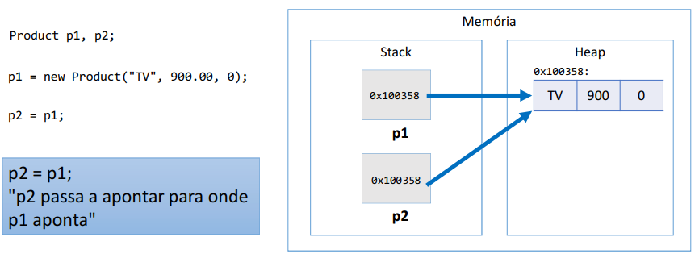

Tipos referência aceitam o valor "null", que indica que a variável aponta pra ninguém.

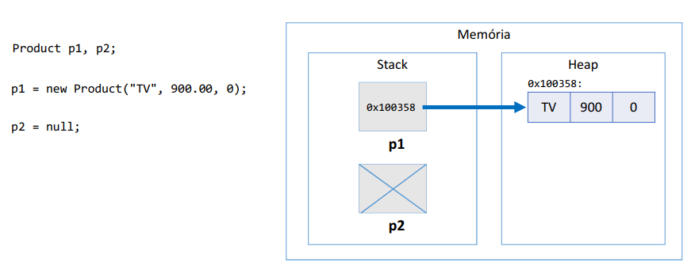

**Structs são tipos valor**

A linguagem C# possui também tipos valor, que são os "structs". Structs são CAIXAS e não ponteiros.

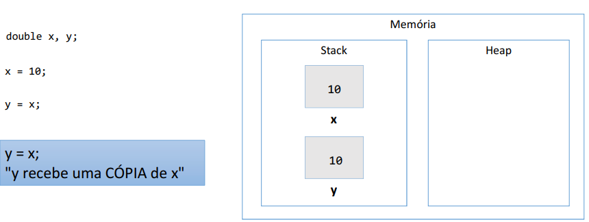


É possível criar seus próprios structs

```csharp
namespace Course {
    struct Point {
        public double X, Y;
        public override string ToString() {
            return "(" + X + "," + Y + ")";
        }
    }
}
```

```csharp
    Point p;
    Console.WriteLine(p); // erro: variável não atribuida
    p.X = 10;
    p.Y = 20;
    Console.WriteLine(p);

    p = new Point();
    Console.WriteLine(p);
```

**Valores padrão**

  - Quando alocamos (new) qualquer tipo estruturado (classe, struct, array), são atribuídos valores padrão aos seus elementos
  - números: 0
  - bool: False
  - char: caractere código 0
  - objeto: null
  - Lembrando: uma variável apenas declarada, mas não instanciada, inicia em estado "não atribuída", e o próprio compilador não permite que ela seja acessada.

**Tipos referência vs. tipos valor**

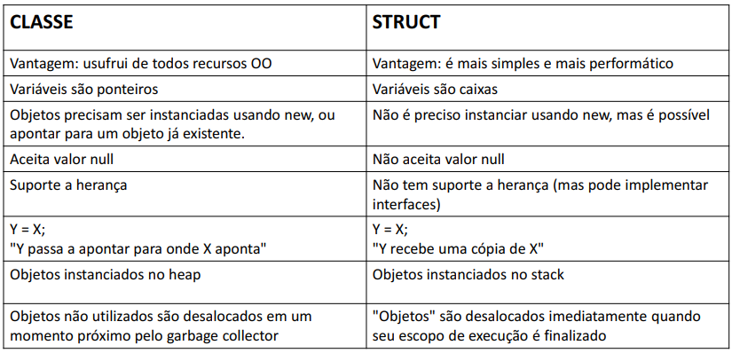


- 67 Desalocação de memória - garbage collector e escopo local

**Garbage collector**

- É um processo que automatiza o gerenciamento de memória de um programa em execução
- O garbage collector monitora os objetos alocados dinamicamente pelo programa (no heap), desalocando aqueles que não estão mais sendo utilizados.

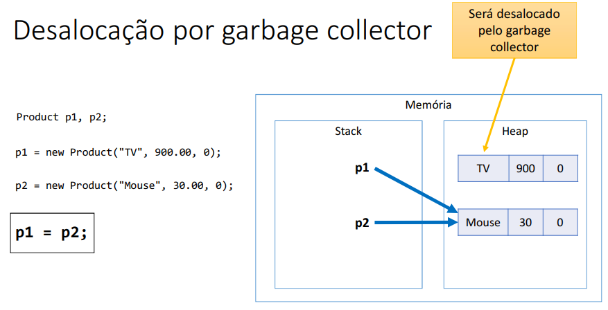

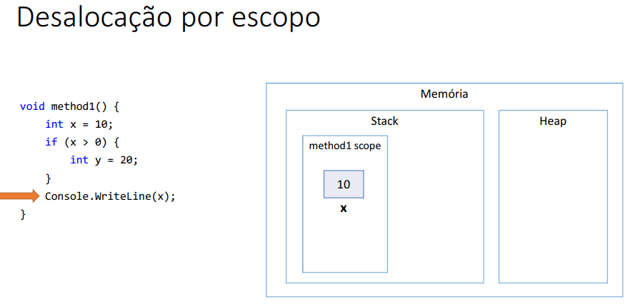


  - *Objetos alocados dinamicamente, quando não possuem mais referência para eles, serão desalocados pelo garbage collector*
  - *Variáveis locais são desalocadas imediatamente assim que seu escopo local sai de execução*


- 68 Nullable

**Nullable**
- É um recurso de C# para que dados de tipo valor (structs) possam receber o valor null
  - Uso comum:
    - Campos de banco de dados que podem valer nulo (data de nascimento, algum valor numérico, etc.).
    - Dados e parâmetros opcionais.

```csharp
    double x = null; // erro
    Nullable<double> x = null;
    double? x = null;
```

- Métodos:
  - GetValueOrDefault
  - HasValue
  - Value (lança uma exceção se não houver valor)
- Um nullable não pode ser atribuído para um struct comum
- Valor default para tipos:
  - https://docs.microsoft.com/en-us/dotnet/csharp/programming-guide/statements-expressions-operators/default-value-expressions

```csharp
using System;
namespace Course {
    class Program {
        static void Main(string[] args) {
            double? x = null;
            double? y = 10.0;
            Console.WriteLine(x.GetValueOrDefault());
            Console.WriteLine(y.GetValueOrDefault());
            Console.WriteLine(x.HasValue);
            Console.WriteLine(y.HasValue);
            if (x.HasValue)
            Console.WriteLine(x.Value);
            else
            Console.WriteLine("X is null");
            if (y.HasValue)
            Console.WriteLine(y.Value);
            else
            Console.WriteLine("Y is null");
        }
    }
}
```

- Operador de coalescência nula
  - https://docs.microsoft.com/en-us/dotnet/csharp/languagereference/operators/null-conditional-operator

```csharp
    double? x = null;
    double y = x ?? 0.0;
```

- 69 Vetores - PARTE 1

- Em programação, "vetor" é o nome dado a arranjos unidimensionais
- Arranjo é uma estrutura de dados:
  - Homogênea (dados do mesmo tipo)
  - Ordenada (elementos acessados por meio de posições)
  - Alocada de uma vez só, em um bloco contíguo de memória
- Vantagens:
  - Acesso imediato aos elementos pela sua posição
- Desvantagens:
  - Tamanho fixo
  - Dificuldade para se realizar inserções e deleções

Problemas Exemplo 1

Fazer um programa para ler um número inteiro N e a altura de N pessoas.
Armazene as N alturas em um vetor. Em seguida, mostrar a altura média dessas pessoas.

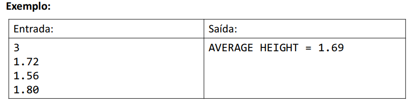


```csharp
using System;
using System.Globalization;

namespace vetor1
{
    class Program
    {
        static void Main(string[] args)
        {
            Console.WriteLine("Entre com os dados");
            int n = int.Parse(Console.ReadLine());
            double[] vect = new double[n];
            for (int i = 0; i < n; i++) {
            vect[i] = double.Parse(Console.ReadLine(), CultureInfo.InvariantCulture);
            }
            double sum = 0.0;
            for (int i = 0; i < n; i++) {
            sum += vect[i];
            }
            double avg = sum / n;
            Console.WriteLine("AVERAGE HEIGHT = " + avg.ToString("F2", CultureInfo.InvariantCulture));
        }
    }
}

```


- 70 Vetores - PARTE 2

Fazer um programa para ler um número inteiro N e os dados (nome e preço) de N Produtos. Armazene os N produtos em um vetor. Em seguida, mostrar o preço médio dos produtos.


```csharp
namespace vetor2
{
    public class Product
    {
        public string Name {get; set;}
        public double Price {get; set;}
    }
}
```

```csharp

using System;
using System.Globalization;

namespace vetor2
{
    class Program
    {
        static void Main(string[] args)
        {
            int n = int.Parse(Console.ReadLine());

            Product[] vect = new Product[n];

            for(int i = 0 ; i < n ; i++){
                string name  = Console.ReadLine();
                double price = double.Parse(Console.ReadLine(), CultureInfo.InvariantCulture);
                vect[i] = new Product{Name = name, Price = price};
            }

            double sum = 0.0;

            for (int i = 0; i < n; i++)
            {
                sum += vect[i].Price;
            }

            double avg = sum/n;
            Console.WriteLine("AVERAGE PRICE = " + avg.ToString("F2", CultureInfo.InvariantCulture));
        }
    }
}


```

- 71 Exercício de fixação (vetores)

A dona de um pensionato possui dez quartos para alugar para estudantes, sendo esses quartos identificados pelos números 0 a 9.

Quando um estudante deseja alugar um quarto, deve-se registrar o nome e email deste estudante.

Fazer um programa que inicie com todos os dez quartos vazios, e depois leia uma quantidade N representando o número de estudantes que vão alugar quartos (N pode ser de 1 a 10). Em seguida, registre o aluguel dos N estudantes. Para cada registro de aluguel, informar o nome e email do
estudante, bem como qual dos quartos ele escolheu (de 0 a 9). Suponha que seja escolhido um quarto vago. Ao final, seu programa deve imprimir um relatório de todas ocupações do pensionato, por ordem de quarto, conforme exemplo.

```
Quantos quartos serão alugados? 3

Aluguel #1:
Nome: Maria Green
Email: maria@gmail.com
Quarto: 5

Aluguel #2:
Nome: Marco Antonio
Email: marco@gmail.com
Quarto: 1

Aluguel #3:
Nome: Alex Brown
Email: alex@gmail.com
Quarto: 8

Quartos ocupados:
1: Marco Antonio, marco@gmail.com
5: Maria Green, maria@gmail.com
8: Alex Brown, alex@gmail.com
```

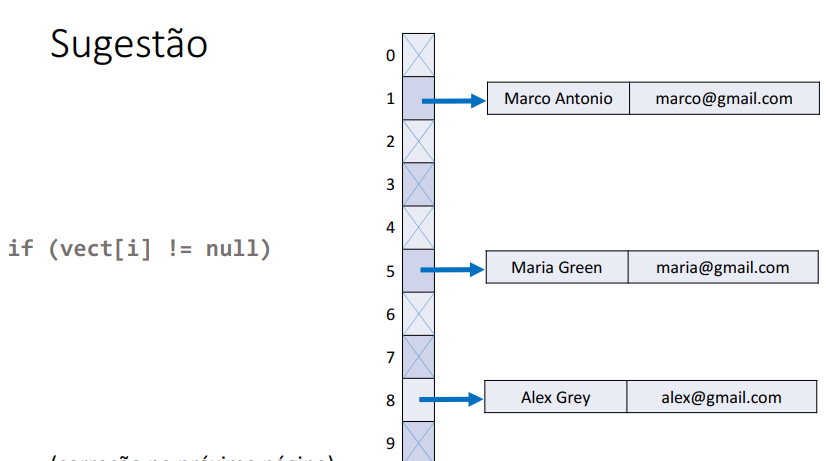

```csharp
namespace Exer1
{
  public class Estudante
  {
    public string Nome { get; set; }
    public string Email { get; set; }
    public Estudante(string nome, string email)
    {
      Nome = nome;
      Email = email;
    }
    public override string ToString()
    {
      return Nome + ", " + Email;
    }
  }
}
```
```csharp
using System;

namespace Exer1
{
  class Program
  {
    static void Main(string[] args)
    {
      Estudante[] vect = new Estudante[10];
      Console.Write("Quantos quartos serão alugados? ");
      int n = int.Parse(Console.ReadLine());
      for (int i = 1; i <= n; i++)
      {
        Console.WriteLine();
        Console.WriteLine($"Aluguel #{i}:");
        Console.Write("Nome: ");
        string nome = Console.ReadLine();
        Console.Write("Email: ");
        string email = Console.ReadLine();
        Console.Write("Quarto: ");
        int quarto = int.Parse(Console.ReadLine());
        vect[quarto] = new Estudante(nome, email);
      }
      Console.WriteLine();
      Console.WriteLine("Quartos ocupados:");
      for (int i = 0; i < 10; i++)
      {
        if (vect[i] != null)
        {
          Console.WriteLine(i + ": " + vect[i]);
        }
      }
    }
  }
}

```
- 72 Modificador de parâmetros params

Suponha que se queira uma calculadora para calcular a soma de uma quantidade variável de valores. Solução ruim usando sobrecarga:

```csharp
namespace Course {
    class Calculator {
        public static int Sum(int n1, int n2) {
            return n1 + n2;
        }
        public static int Sum(int n1, int n2, int n3) {
            return n1 + n2 + n3;
        }
        public static int Sum(int n1, int n2, int n3, int n4) {
            return n1 + n2 + n3 + n4;
        }
    }
}
```

*Solução com vetor:*

```csharp
namespace Course {
    class Calculator {
        public static int Sum(int[] numbers) {
            int sum = 0;
            for (int i=0; i<numbers.Length; i++) {
                sum += numbers[i];
            }
            return sum;
        }
    }
}
```

```csharp
    int result = Calculator.Sum(new int[] { 10, 20, 30, 40 });
```

**Solução com modificador params:**

```csharp
namespace Course {
    class Calculator {
        public static int Sum(params int[] numbers) {
            int sum = 0;
            for (int i=0; i<numbers.Length; i++) {
            sum += numbers[i];
            }
            return sum;
        }
    }
}
```

```csharp
    int result = Calculator.Sum(10, 20, 30, 40);
```

- 73 Modificadores de parâmetros ref e out

- Modificador ref
Suponha que se queira uma calculadora com uma operação para triplicar o valor de um número passado como parâmetro. A seguir uma solução que não funciona:

```csharp
class Calculator {
    public static void Triple(int x) {
        x = x * 3;
    }
}
```

```csharp
class Program {
static void Main(string[] args) {
    int a = 10;
    Calculator.Triple(a);
    Console.WriteLine(a);
```

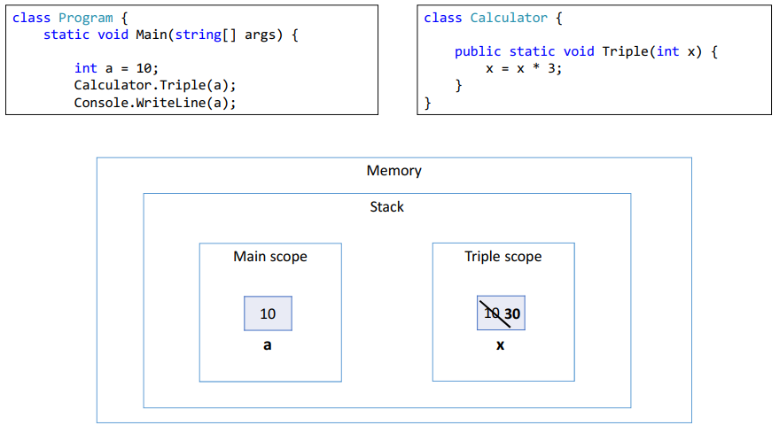


- Modificador out

O modificador out é similar ao ref (faz o parâmetro ser uma referência para a variável original), mas não exige que a variável original seja iniciada.


*Considerações sobre ref e out*

- Diferença:
- A variável passada como parâmetro ref DEVE ter sido iniciada
- A variável passada como parâmetro out não precisa ter sido iniciada
- Conclusão: ambos são muito similares, mas ref é uma forma de fazer o compilador obrigar o usuário a iniciar a variável.
- Nota: *ambos são considerados "code smells" (design ruim) e devem ser evitados.*


- 74 Boxing e unboxing

Boxing - É o processo de conversão de um objeto tipo valor para um objeto tipo referência compatível

unboxing - É o processo de conversão de um objeto tipo referência para um objeto tipo valor compatível


- 75 Sintaxe opcional: laço foreach

Sintaxe opcional e simplificada para percorrer coleções

Leitura: "para cada objeto 'obj' contido em vect, faça:"

```csharp
string[] vect = new string[] { "Maria", "Bob", "Alex"};
foreach (string obj in vect) {
    Console.WriteLine(obj);
}
```

- 76 Listas (List) - PARTE 1

  - https://msdn.microsoft.com/en-us/library/6sh2ey19(v=vs.110).aspx

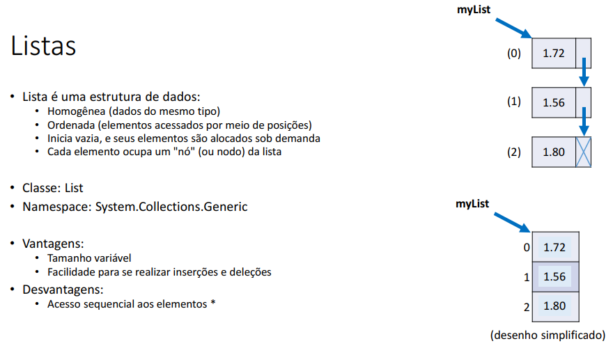


- 77 Listas (List) - PARTE 2

- Inserir elemento na lista: *Add*, *Insert*
- Tamanho da lista: *Count*
- Encontrar primeiro ou último elementos da lista que satisfaça um predicado:
*list.Find*, *list.FindLast*
- Encontrar primeira ou última posição de elemento da lista que satisfaça um predicado: *list.FindIndex, list.FindLastIndex*
- Filtrar a lista com base em um predicado: *list.FindAll*
- Remover elementos da lista: *Remove, RemoveAll, RemoveAt, RemoveRange*
- Assuntos pendentes:
  - Generics
  - Predicados (lambda)

```csharp
using System;
using System.Collections.Generic;

namespace list1
{
  class Program
  {
    static void Main(string[] args)
    {
      List<string> list = new List<string>();
      list.Add("Maria");
      list.Add("Alex");
      list.Add("Bob");
      list.Add("Anna");
      list.Insert(2, "Marco");
      foreach (string obj in list)
      {
        Console.WriteLine(obj);
      }
      Console.WriteLine("List count: " + list.Count);
      string s1 = list.Find(x => x[0] == 'A');
      Console.WriteLine("First 'A': " + s1);
      string s2 = list.FindLast(x => x[0] == 'A');
      Console.WriteLine("Last 'A': " + s2);
      int pos1 = list.FindIndex(x => x[0] == 'A');
      Console.WriteLine("First position 'A': " + pos1);
      int pos2 = list.FindLastIndex(x => x[0] == 'A');
      Console.WriteLine("Last position 'A': " + pos2);
      List<string> list2 = list.FindAll(x => x.Length == 5);
      Console.WriteLine("---------------------");
      foreach (string obj in list2)
      {
        Console.WriteLine(obj);
      }
      list.Remove("Alex");
      Console.WriteLine("---------------------");
      foreach (string obj in list)
      {
        Console.WriteLine(obj);
      }
      list.RemoveAll(x => x[0] == 'M');
      Console.WriteLine("---------------------");
      foreach (string obj in list)
      {
        Console.WriteLine(obj);
      }
    }
  }
}

```

- 78 Exercício de fixação (listas)

Fazer um programa para ler um número inteiro N e depois os dados (id, nome e salario) de N funcionários. Não deve haver repetição de id.

Em seguida, efetuar o aumento de X por cento no salário de um determinado funcionário. Para isso, o programa deve ler um id e o valor X. Se o id informado não existir, mostrar uma mensagem e abortar a operação. Ao final, mostrar a listagem atualizada dos funcionários, conforme exemplos.

Lembre-se de aplicar a técnica de encapsulamento para não permitir que o salário possa ser mudado livremente. Um salário só pode ser aumentado com base em uma operação de aumento por porcentagem dada

```
How many employees will be registered? 3

Emplyoee #1:
Id: 333
Name: Maria Brown
Salary: 4000.00

Emplyoee #2:
Id: 536
Name: Alex Grey
Salary: 3000.00

Emplyoee #3:
Id: 772
Name: Bob Green
Salary: 5000.00

Enter the employee id that will have salary increase : 536
Enter the percentage: 10.0

Updated list of employees:
333, Maria Brown, 4000.00
536, Alex Grey, 3300.00
772, Bob Green, 5000.00
```

```
How many employees will be registered? 2

Emplyoee #1:
Id: 333
Name: Maria Brown
Salary: 4000.00

Emplyoee #2:
Id: 536
Name: Alex Grey
Salary: 3000.00

Enter the employee id that will have salary increase: 776
This id does not exist!

Updated list of employees:
333, Maria Brown, 4000.00
536, Alex Grey, 3000.00
```

```csharp
using System.Globalization;

namespace exerLista1
{
  public class Employee
  {
    public int Id { get; set; }
    public string Name { get; set; }
    public double Salary { get; private set; }

    public Employee(int id, string name, double salary)
    {
      Id = id;
      Name = name;
      Salary = salary;
    }

    public void IncreaseSalary(double percentage)
    {
      Salary += Salary * percentage / 100.0;
    }

    public override string ToString()
    {
      return Id
          + ", "
          + Name
          + ", "
          + Salary.ToString("F2", CultureInfo.InvariantCulture);
    }
  }
}
```

```csharp
using System;
using System.Globalization;
using System.Collections.Generic;

namespace exerLista1
{
  class Program
  {
    static void Main(string[] args)
    {
      Console.Write("How many employees will be registered? ");
      int n = int.Parse(Console.ReadLine());

      List<Employee> list = new List<Employee>();

      for (int i = 1; i <= n; i++)
      {
        Console.WriteLine("Employee #" + i + ":");
        Console.Write("Id: ");
        int id = int.Parse(Console.ReadLine());
        Console.Write("Name: ");
        string name = Console.ReadLine();
        Console.Write("Salary: ");
        double salary = double.Parse(Console.ReadLine(), CultureInfo.InvariantCulture);
        list.Add(new Employee(id, name, salary));
        Console.WriteLine();
      }

      Console.Write("Enter the employee id that will have salary increase : ");
      int searchId = int.Parse(Console.ReadLine());

      Employee emp = list.Find(x => x.Id == searchId);
      if (emp != null)
      {
        Console.Write("Enter the percentage: ");
        double percentage = double.Parse(Console.ReadLine(), CultureInfo.InvariantCulture);
        emp.IncreaseSalary(percentage);
      }
      else
      {
        Console.WriteLine("This id does not exist!");
      }

      Console.WriteLine();
      Console.WriteLine("Updated list of employees:");
      foreach (Employee obj in list)
      {
        Console.WriteLine(obj);
      }
    }
  }
}

```


- 79 Matrizes


```csharp
    double[,] mat = new double[2, 3];
    Console.WriteLine(mat.Length);
    Console.WriteLine(mat.Rank);
    Console.WriteLine(mat.GetLength(0));
    Console.WriteLine(mat.GetLength(1));
```

- 80 Exercício resolvido (matrizes)

Fazer um programa para ler um número inteiro N e uma matriz de ordem N contendo números inteiros. Em seguida, mostrar a diagonal principal e a quantidade de valores negativos da matriz.


```csharp
using System;

namespace exerMatriz1
{
  class Program
  {
    static void Main(string[] args)
    {
      int n = int.Parse(Console.ReadLine());

      int[,] mat = new int[n, n];

      for (int i = 0; i < n; i++)
      {
        string[] values = Console.ReadLine().Split(' ');
        for (int j = 0; j < n; j++)
        {
          mat[i, j] = int.Parse(values[j]);
        }
      }

      Console.WriteLine("Main diagonal:");
      for (int i = 0; i < n; i++)
      {
        Console.Write(mat[i, i] + " ");
      }
      Console.WriteLine();

      int count = 0;
      for (int i = 0; i < n; i++)
      {
        for (int j = 0; j < n; j++)
        {
          if (mat[i, j] < 0)
          {
            count++;
          }
        }
      }
      Console.WriteLine("Negative numbers: " + count);
    }
  }
}

```

- 81 Exercício de fixação (matrizes)

Fazer um programa para ler dois números inteiros M e N, e depois ler uma matriz de M linhas por N colunas contendo números inteiros, podendo haver repetições. Em seguida, ler um número inteiro X que pertence à matriz. Para cada ocorrência de X, mostrar os valores à esquerda, acima, à direita e abaixo de X, quando houver, conforme exemplo.

```
3 4
10 8 15 12
21 11 23 8
14 5 13 19
8

Position 0,1:
Left: 10
Right: 15
Down: 11
Position 1,3:
Left: 23
Up: 12
Down: 19
```

```csharp
using System;

namespace exerMatriz2
{
  class Program
  {
    static void Main(string[] args)
    {
      string[] line = Console.ReadLine().Split(' ');
      int m = int.Parse(line[0]);
      int n = int.Parse(line[1]);

      int[,] mat = new int[m, n];

      for (int i = 0; i < m; i++)
      {
        string[] values = Console.ReadLine().Split(' ');
        for (int j = 0; j < n; j++)
        {
          mat[i, j] = int.Parse(values[j]);
        }
      }

      int x = int.Parse(Console.ReadLine());

      for (int i = 0; i < m; i++)
      {
        for (int j = 0; j < n; j++)
        {
          if (mat[i, j] == x)
          {
            Console.WriteLine("Position " + i + "," + j + ":");
            if (j > 0)
            {
              Console.WriteLine("Left: " + mat[i, j - 1]);
            }
            if (i > 0)
            {
              Console.WriteLine("Up: " + mat[i - 1, j]);
            }
            if (j < n - 1)
            {
              Console.WriteLine("Right: " + mat[i, j + 1]);
            }
            if (i < m - 1)
            {
              Console.WriteLine("Down: " + mat[i + 1, j]);
            }
          }
        }
      }
    }
  }
}

```


- 82 Conjuntos (aviso)

[Voltar ao Índice](#indice)

---


## <a name="parte7">7 - Tópicos especiais em C# - PARTE 1</a>

- 83 Visão geral do capítulo
- 84 Material de apoio do capítulo
- 85 Inferência de tipos: palavra var

```csharp
    var x = 10;
    var y = 20.0;
    var z = "Maria";
    Console.WriteLine(x);
    Console.WriteLine(y);
    Console.WriteLine(z);
```

- 86 Sintaxe alternativa - switch-case
    - Estrutura opcional a vários if-else encadeados, quando a condição envolve o teste do valor de uma variável
  
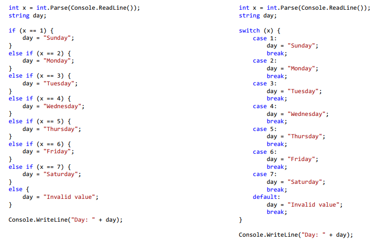  

- 87 Sintaxe alternativa - expressão condicional ternária

Estrutura opcional ao if-else quando se deseja decidir um VALOR com base em uma condição.

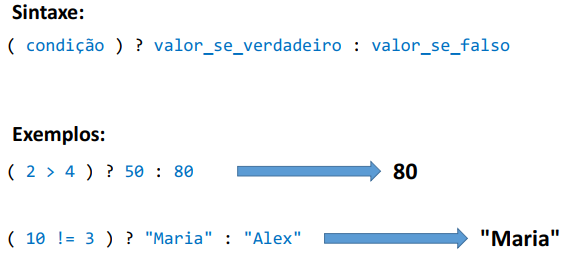

```csharp
double preco = 34.5;
double desconto;

if (preco < 20.0) {
    desconto = preco * 0.1;
}
else {
    desconto = preco * 0.05;
}
```

```csharp
    double preco = 34.5;
    double desconto = (preco < 20.0) ? preco * 0.1 : preco * 0.05;
```

- 88 Funções interessantes para string
- 89 DateTime - representando data e hora
- 90 TimeSpan - representando durações
- 91 Propriedades e operações com DateTime
- 92 Propriedades e operações com TimeSpan
- 93 DateTimeKind e padrão ISO 8601

[Voltar ao Índice](#indice)

---


## <a name="parte8">8 - Introdução ao Git e Github</a>


[Voltar ao Índice](#indice)

---


## <a name="parte9">9 - Enumerações e composição</a>


[Voltar ao Índice](#indice)

---


## <a name="parte10">10 - Herança e polimorfismo</a>


[Voltar ao Índice](#indice)

---


## <a name="parte11">11 - Tratamento de exceções</a>


[Voltar ao Índice](#indice)

---


## <a name="parte12">12 - Projeto: Sistema de jogo de xadrez</a>


[Voltar ao Índice](#indice)

---


## <a name="parte13">13 - Trabalhando com arquivos</a>


[Voltar ao Índice](#indice)

---


## <a name="parte14">14 - Interfaces</a>


[Voltar ao Índice](#indice)

---


## <a name="parte15">15 - Tópicos especiais em C# - PARTE 2</a>


[Voltar ao Índice](#indice)

---


## <a name="parte16">16 - Expressões lambda, delegates, LINQ</a>


[Voltar ao Índice](#indice)

---


## <a name="parte17">17 - Projeto: Sistema Web com ASP .NET Core MVC e Entity Framework</a>


[Voltar ao Índice](#indice)

---


## <a name="parte18">18 - Seção bônus</a>


[Voltar ao Índice](#indice)

---

